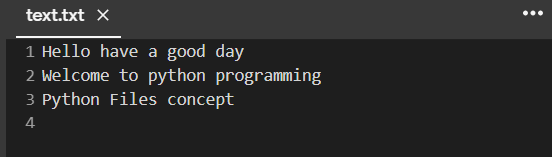

# Word-count
## AIM:
To write a python program for getting the word count from a text.
## EQUIPEMENT'S REQUIRED: 
PC
Anaconda - Python 3.7

## DESIGN STEPS:

Step 1:
Assign a variable for value zero

Step 2:
open then required file by using the function "with"

Step 3:
Then use the for loop for assigning the i value in the file

Step 4:
using split function to split the words

Step 5:
Finding the length of the words by using len() function

Step 6:
Calling the function and printing the number of words.

## PROGRAM:
```
#text.txt
with open("text.txt",'w')as fp:
  fp.write("Hello have a good day")
  fp.write("\nWelcome to python programming")
  fp.write("\nPython Files concept\n")
def wordcount(filename):
  count = 0
  with open(filename,"r") as f1:
    data=f1.readlines()
    for line in data:
      word=line.split()
      for i in word:
          count += 1
  print("The word count is", count)
filename=input("Enter filename:")
wordcount(filename)
```

### OUTPUT:




## RESULT:
Thus the program is written to find the word count from a text.
